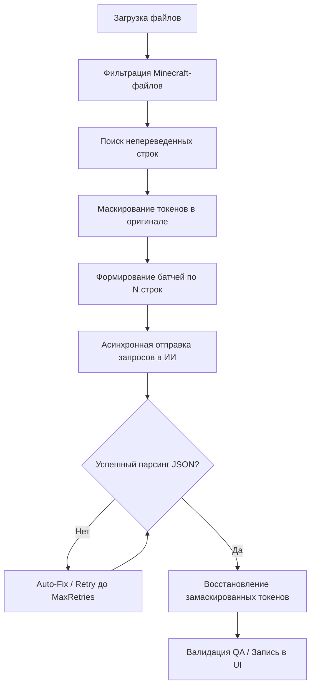

# Техническое Задание: AI Mod Translator (WPF / .NET 8)

## Автоматический переводчик модов Minecraft с использованием нейросетей

---

**Версия документа:** 3.0  
**Дата обновления:** 2026  
**Стек:** C# 12 / .NET 8 (WPF)  
**Статус:** Утверждено

---

## Содержание

1. [Общие сведения](#1-общие-сведения)
2. [Функциональные требования](#2-функциональные-требования)
3. [Технический стек](#3-технический-стек)
4. [Архитектура и логика работы ИИ](#4-архитектура-и-логика-работы-ии)
5. [Требования к безопасности и производительности](#5-требования-к-безопасности-и-производительности)
6. [Этапы разработки (Roadmap)](#6-этапы-разработки-roadmap)
7. [Критерии приемки](#7-критерии-приемки)
8. [Риски и пути решения](#8-риски-и-пути-решения)
9. [Структура проекта](#9-структура-проекта)
10. [Пример WPF MVVM кода](#10-пример-wpf-mvvm-кода)
11. [Команды для разработки](#11-команды-для-разработки)

---

## 1. Общие сведения

| Параметр | Описание |
| :--- | :--- |
| **Название проекта** | AI Mod Translator |
| **Тип приложения** | Desktop Utility (WPF GUI) |
| **Язык разработки** | C# 12 / .NET 8 |
| **GUI Фреймворк** | **WPF** (с использованием Material Design in XAML) |
| **Архитектурный паттерн** | MVVM (CommunityToolkit.Mvvm) |
| **Основная цель** | Автоматизация и ручной перевод файлов локализации модов Minecraft с сохранением технической целостности файлов |
| **Ключевая особенность** | Защита тегов и плейсхолдеров, асинхронный перевод батчами через OpenAI или локальные LLM (Ollama/LM Studio), база Translation Memory в SQLite |

---

## 2. Функциональные требования

### 2.1. Работа с файлами модов

1. **Поддержка форматов:**
   - Входные файлы: `.jar` (архивы модов), папки с распакованными модами, отдельные файлы локализации.
   - Файлы локализации: `.json` (Minecraft 1.13+), `.lang` (Legacy-форматы, ключ=значение), `.properties`, `.toml` (конфигурационные файлы локализации).

2. **Извлечение и упаковка:**
   - Автоматическая распаковка `.jar` мода во временную директорию приложения.
   - Сканирование файлов и фильтрация: поиск путей вида `assets/<mod_id>/lang/`.
   - Обратная сборка и упаковка в `.jar` архив с сохранением структуры.

3. **Кодировки:**
   - Автоматическое определение кодировки исходных файлов (UTF-8, UTF-8-BOM, Latin-1, Windows-1251) с использованием библиотеки `UtfUnknown`.
   - Сохранение файлов строго в кодировке UTF-8 без BOM.

### 2.2. Интеграция с нейросетями (AI Core)

1. **Режимы работы:**
   - **Cloud:** Перевод через официальное API OpenAI (модель по умолчанию: `gpt-4o-mini`).
   - **Local:** Перевод через локальные модели (Ollama / LM Studio) по OpenAI-совместимому API.

2. **Контекст и память:**
   - **Glossary (Глоссарий):** Возможность добавления строгих терминов и их переводов, которые передаются в системном промпте для ИИ.
   - **Translation Memory (Память переводов):** Глобальная база данных SQLite для сохранения пар «Оригинал -> Мой Перевод». При повторном нахождении идентичной строки перевод берется из базы автоматически.

3. **Валидация и автоисправление ответа:**
   - Предотвращение падений при невалидных ответах ИИ (цикл попыток `MaxRetries` с экспоненциальной задержкой).
   - Очистка ответов ИИ: обрезка markdown-блоков (````json ... ````), поиск границ массива `[...]`, удаление лишних запятых перед закрывающими скобками.

### 2.3. Защита форматирования (Критично)

1. **Коды цвета Minecraft:**
   - Защита спецсимволов вида `§[0-9a-fk-or]` от изменения или перевода нейросетью.

2. **Плейсхолдеры и переменные:**
   - Защита строк форматирования: `%s`, `%d`, `%1$s`, `{count}`, `{0}`.

3. **Логика защиты:**
   - Перед отправкой строки маскируются временными токенами вида `__AIMT_TOKEN_X__`. После получения перевода токены заменяются обратно на исходные значения.

### 2.4. Интерфейс пользователя (WPF GUI)

1. **Панель инструментов:**
   - Кнопки для открытия файла, папки, JAR-архива, а также загрузки из репозитория GitHub.
   - Кнопка запуска ИИ-перевода и сохранения изменений.
   - Кнопки управления глоссарием, проверки качества (QA), импорта и экспорта Translation Memory.

2. **Рабочая область:**
   - Слева: список (карточки строк) с отображением оригинала, перевода, статуса и индикацией ошибок QA (подсветка красной рамкой).
   - Справа: панель деталей выбранной строки (редактор перевода, оригинал, ключ, предложение ИИ, превью отображения в игре с поддержкой оригинальных цветов Minecraft, ошибки QA).

3. **Лог-панель:**
   - Нижняя раскрывающаяся панель логов для отображения хода работы в реальном времени (уровни: INFO, WARN, ERROR).

4. **Экран загрузки (Loading Overlay):**
   - Блокирующий экран с эффектом размытия (Blur), отображающий текущий файл, ETA (оставшееся время), скорость (строк/мин) и прогресс-бар.

---

## 3. Технический стек

| Компонент | Технология / Библиотека | Обоснование |
| :--- | :--- | :--- |
| **Язык** | C# 12 / .NET 8 | Высокая производительность, статическая типизация, современный синтаксис |
| **UI Фреймворк** | WPF (Windows Presentation Foundation) | Нативный UI для Windows с мощными механизмами разметки и стилизации |
| **MVVM** | `CommunityToolkit.Mvvm` | Официальный современный MVVM Toolkit от Microsoft (Source Generators) |
| **Стиль & UI элементы**| `MaterialDesignThemes` | Реализация красивой современной темной темы в стиле Material Design |
| **База данных** | SQLite + Entity Framework Core | Легковесная локальная база данных для кэша и глоссария с поддержкой LINQ |
| **Определение кодировок**| `UtfUnknown` (Ude.NetStandard) | Надежное определение кодировок legacy-файлов (.lang) |
| **Сетевые запросы** | `HttpClient` | Асинхронное взаимодействие с API OpenAI и GitHub |
| **Парсинг JSON** | `System.Text.Json` | Встроенный высокопроизводительный парсер .NET |

---

## 4. Архитектура и логика работы ИИ

### 4.1. Архитектура обработки и перевода (Batch Pipeline)



1. **Препроцессинг и токенизация:**
   - Извлечение текста из файлов.
   - Маскирование кодов цвета и плейсхолдеров (класс `MinecraftTokenProtector`).
2. **Батчинг:**
   - Группировка строк в батчи размером `BatchSize` для ускорения перевода и снижения затрат на токены.
3. **Запрос и промпт:**
   - Системный промпт указывает ИИ переводить строго для Minecraft, соблюдать игровой сленг и не изменять технические токены `__AIMT_TOKEN_X__`. К промпту прикрепляются строгие правила глоссария.
4. **Валидация:**
   - Проверка структуры ответа с помощью `AiJsonResponseParser`.
   - Проверка сохранения количества и типов плейсхолдеров в `QAService` после демаскирования.

---

## 5. Требования к безопасности и производительности

### 5.1. Безопасность
- API-ключи OpenAI хранятся на локальном компьютере пользователя в зашифрованном виде с помощью Windows Data Protection API (DPAPI).
- Локальная база данных `TranslationMemory.db` и файл настроек `config.json` хранятся в защищенной директории пользователя `%APPDATA%/AIModTranslator`.

### 5.2. Производительность
- Использование асинхронного программирования (`async/await`) гарантирует отзывчивость UI во время тяжелых дисковых операций и сетевых запросов.
- Многопоточность: возможность отправки нескольких батчей параллельно регулируется параметром `MaxParallelRequests` с ограничением с помощью `SemaphoreSlim`.

---

## 6. Этапы разработки (Roadmap)

### Этап 1: Базовая инфраструктура (.NET 8 WPF)
- [x] Инициализация проекта, настройка DI-контейнера (`Microsoft.Extensions.DependencyInjection`).
- [x] Подключение Entity Framework Core с базой данных SQLite.
- [x] Создание базовой разметки и интеграция Material Design.

### Этап 2: Файловый движок (Парсинг и Архивы)
- [x] Реализация служб для JSON, LANG, TOML.
- [x] Реализация распаковки и упаковки `.jar` файлов через `System.IO.Compression.ZipFile`.
- [x] Внедрение библиотеки `UtfUnknown` для автоопределения кодировок.

### Этап 3: Интеграция AI и Защита данных
- [x] Создание `MinecraftTokenProtector` для маскирования кодов цвета и плейсхолдеров.
- [x] Реализация `OpenAITranslationService` с поддержкой батчинга.
- [x] Разработка парсера и модуля автоматического исправления невалидных JSON-ответов (`AiJsonResponseParser`).

### Этап 4: Пользовательский опыт и интерфейс
- [x] Реализация интерактивного превью в стиле чата Minecraft.
- [x] Добавление лог-панели на главный экран.
- [x] Создание оверлея загрузки с расчетом скорости перевода и ETA.
- [x] Реализация Drag & Drop для файлов, папок и JAR-архивов.

---

## 7. Критерии приемки

1. Приложение без ошибок открывает любой JAR-мод Minecraft, извлекает и парсит языковые файлы.
2. Приложение корректно маскирует все коды цвета (`§`) и плейсхолдеры, гарантируя их целостность после перевода.
3. База данных SQLite корректно сохраняет и автоматически подставляет прошлые переводы (Translation Memory).
4. Ошибки в переведенных строках (потеря токенов) подсвечиваются в интерфейсе.
5. Приложение упаковывает переведенный мод обратно в валидный JAR-архив с сохранением исходной структуры.

---

## 8. Риски и пути решения

| Риск | Уровень | Решение |
| :--- | :---: | :--- |
| **Галлюцинации ИИ (изменение токенов)** | Высокий | Защита маскированием + валидация в `QAService` с подсветкой ошибок. |
| **Блокировка по Rate Limit в API** | Средний | Реализация экспоненциальной задержки (Exponential Backoff) при повторных попытках. |
| **Невалидный JSON от ИИ** | Высокий | Использование regex-очистки (`AiJsonResponseParser`) и механизма повторных попыток. |
| **Кроссплатформенность** | Средний | Использование WPF ограничивает приложение ОС Windows. Код шифрования DPAPI также привязан к Windows. Для переноса на macOS/Linux потребуется миграция UI на Avalonia UI и замена DPAPI на кроссплатформенное решение. |

---

## 9. Структура проекта

```text
AIModTranslator/
│
├── Data/                   # Слой данных (EF Core и БД)
│   ├── AppDbContext.cs     # Контекст базы данных SQLite
│   ├── GlossaryEntry.cs    # Сущность записи глоссария
│   └── TmEntry.cs          # Сущность записи Translation Memory
│
├── Helpers/                # Вспомогательные классы и бихейвиоры
│   ├── MinecraftTextBehavior.cs       # Визуализация Minecraft цветов (§c) в TextBlock
│   ├── RegexHelpers.cs                # Регулярные выражения для поиска токенов
│   └── RichTextBoxSyntaxBehavior.cs   # Подсветка синтаксиса в текстовом редакторе
│
├── Models/                 # Бизнес-модели
│   ├── AppConfig.cs        # Настройки приложения
│   └── TranslationEntry.cs # Строка перевода
│
├── Services/               # Сервисный слой (Бизнес-логика)
│   ├── Interfaces/         # Интерфейсы сервисов
│   ├── AiJsonResponseParser.cs        # Очистка и парсинг JSON-ответов ИИ
│   ├── FileServices.cs                # Парсеры JSON, LANG, TOML
│   ├── MinecraftTokenProtector.cs     # Защита спецсимволов и переменных
│   ├── OpenAITranslationService.cs    # Клиент перевода (OpenAI/Ollama)
│   ├── QAService.cs                   # Валидация перевода (QA)
│   └── TranslationMemoryService.cs    # Логика сохранения перевода в SQLite
│
├── ViewModels/             # ViewModel (Связующее звено MVVM)
│   ├── MainViewModel.cs               # Основная логика главного окна
│   ├── MainViewModel.Loading.cs       # Методы асинхронного импорта/загрузки
│   └── SettingsViewModel.cs           # Логика настройки приложения
│
└── Views/                  # XAML-разметка окон (Представления)
    ├── MainWindow.xaml                # Главное окно редактора
    └── SettingsWindow.xaml            # Окно конфигурации
```

---

## 10. Пример WPF MVVM кода

*Пример реализации команды асинхронного перевода батчами в ViewModel:*

```csharp
[RelayCommand]
private async Task TranslateAllAsync()
{
    var untranslated = Translations.Where(t => string.IsNullOrWhiteSpace(t.TranslatedText)).ToList();
    if (untranslated.Count == 0) return;

    IsBusy = true;
    TranslationTotal = untranslated.Count;
    TranslationProgress = 0;

    var stopwatch = Stopwatch.StartNew();
    var translatedSoFar = 0;

    try
    {
        var config = _settingsService.LoadConfig();
        var batches = untranslated.Chunk(config.BatchSize).ToList();

        using var semaphore = new SemaphoreSlim(config.MaxParallelRequests);
        var tasks = batches.Select(async batch =>
        {
            await semaphore.WaitAsync();
            try
            {
                var texts = batch.Select(i => i.OriginalText).ToArray();
                var results = await _translationService.TranslateBatchAsync(texts, config.TargetLanguage);

                await RunOnUiThreadAsync(() =>
                {
                    for (int j = 0; j < batch.Length; j++)
                    {
                        batch[j].TranslatedText = results[j];
                        batch[j].Status = "AutoTranslated";
                        _qaService.Validate(batch[j]);
                    }
                    translatedSoFar += batch.Length;
                    TranslationProgress = translatedSoFar;
                });
            }
            finally
            {
                semaphore.Release();
            }
        });

        await Task.WhenAll(tasks);
    }
    finally
    {
        IsBusy = false;
    }
}
```

---

## 11. Команды для разработки

```bash
# Восстановление зависимостей проекта
dotnet restore

# Сборка решения в режиме Release
dotnet build --configuration Release

# Запуск модульных тестов
dotnet test

# Публикация готового исполняемого файла для Windows (Self-Contained)
dotnet publish AIModTranslator/AIModTranslator.csproj -c Release -r win-x64 --self-contained true -p:PublishSingleFile=true -p:PublishReadyToRun=true
```
